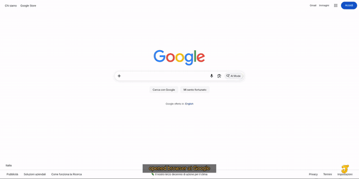

<div id="top"></div>

<div align="center">


**Browser instrumentation for agents.**

✨ [**Quickstart**](#2-quickstart)　•　⭐ [**Architecture**](./docs/ARCHITECTURE.md)　•　⚡ [**MCP**](./docs/MCP.md)　•　💡 [**Documentation**](./docs/README.md)　•　🍯 [**Tool Index**](./.agent/tools/index.md)

<br>



</div>

## 1. About

**Jelly** is a small Rust toolkit that gives AI agents a practical way to observe and control a real Chromium browser.

It turns browser operations such as reading pages, finding interactive elements, clicking, typing, navigating, switching tabs, uploading files, inspecting network traffic, and taking screenshots into reusable primitives that agents can discover and compose.

You do not need to know Chrome DevTools Protocol to use it. Jelly keeps the browser plumbing behind a small command surface while still exposing lower-level escape hatches when needed.

> [!CAUTION]
> Jelly controls a real browser and can perform real actions on websites. Review routines before running them against accounts or systems you care about.

<p align="right"><sub><a href="#top">⭐ Back to top</a></sub></p>

## 2. Quickstart

Interactive setup:

```bash
git clone https://github.com/FabioFlorey/jelly.git
cd jelly
./quickstart.sh
```

The wizard checks dependencies, configures OAuth + hosting, and can install/start Jelly. See [MCP](./docs/MCP.md) for hosting modes and advanced setup.

Use `./quickstart.sh --dry-run` to preview setup, or `./quickstart.sh --check` for prerequisites only.

Or build the tools directly:

```bash
cargo build --bins
```

Open a browser and inspect a page:

```bash
cargo run --quiet --bin agent-run -- \
  open-browser https://example.com

cargo run --quiet --bin agent-run -- read-page
cargo run --quiet --bin agent-run -- snapshot-interactive
```

Act on a discovered element:

```bash
cargo run --quiet --bin agent-run -- click @e1
```

Close the browser:

```bash
cargo run --quiet --bin agent-run -- close-browser
```

Discover tools without loading the full catalog:

```bash
cargo run --quiet --bin agent-discover -- capabilities
cargo run --quiet --bin agent-discover -- search "find form inputs"
cargo run --quiet --bin agent-discover -- schema type-text
```

<p align="right"><sub><a href="#top">⭐ Back to top</a></sub></p>

## 3. Documentation

<div align="center">

| Document | Description |
| :--- | :--- |
| 📒 [**Documentation Index**](./docs/README.md) | Main entry point for the documentation |
| ⚠️ [**Requirements**](./docs/REQUIREMENTS.md) | What must be installed before running Jelly |
| 💡 [**Glossary**](./docs/GLOSSARY.md) | Definitions for technical and project-specific terminology |
| ⭐ [**Architecture**](./docs/ARCHITECTURE.md) | Browser session, primitives, registry, and execution model |
| 🔑 [**Tool Discovery**](./docs/DISCOVERY.md) | Capability discovery, search, and schema loading |
| 🔆 [**Routines**](./docs/ROUTINES.md) | Guarded workflow graphs, branching, loops, and HITL continuation |
| 🍯 [**Reliability**](./docs/RELIABILITY.md) | Verification, typed failures, artifacts, timeouts, and cleanup |
| 📂 [**Runtime Layout**](./docs/RUNTIME.md) | Runtime state, build output, logs, screenshots, and cleanup |
| 🧈 [**Development**](./docs/DEVELOPMENT.md) | Project conventions, tests, and contribution rules |
| ⚡ [**MCP Server**](./docs/MCP.md) | Local MCP endpoint, authentication, tool mapping, and deployment boundary |
| 🍯 [**Tool Index**](./.agent/tools/index.md) | Generated reference for browser primitives and system tools |
| 🌟 [**Changelog**](./CHANGELOG.md) | Development history |

</div>

<p align="right"><sub><a href="#top">⭐ Back to top</a></sub></p>

## 4. Status

Jelly is under active development. Interfaces may change while the execution, discovery, and routine layers settle.

Jelly is currently distributed under a proprietary All Rights Reserved license. See [`LICENSE`](LICENSE) for the applicable terms.

<p align="right"><sub><a href="#top">⭐ Back to top</a></sub></p>
