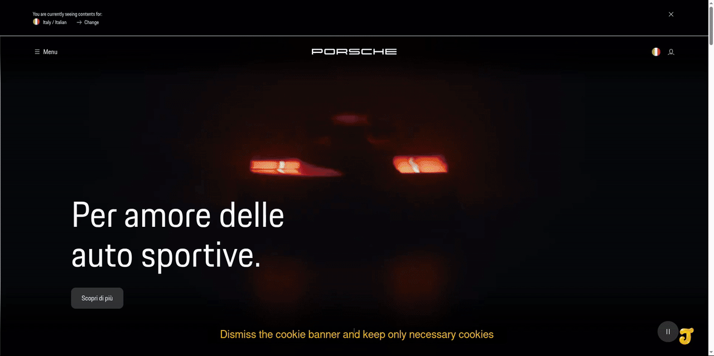

<div id="top"></div>

<div align="center">


**Browser instrumentation for agents**

✨ [**Quickstart**](#3-quickstart)　•　⭐ [**Architecture**](./docs/architecture/ARCHITECTURE.md)　•　⚡ [**MCP**](./docs/reference/MCP.md)　•　💡 [**Documentation**](#8-documentation-and-support)　•　🍯 [**Tool Index**](./.agent/tools/index.md)

📒 [Visit the project website](https://fabioflorey.github.io/jelly/)

[](https://github.com/FabioFlorey/jelly/stargazers) [](https://github.com/FabioFlorey/jelly/forks) [](https://github.com/FabioFlorey/jelly/actions/workflows/ci.yml?query=branch%3Amain+event%3Apush) [](./rust-toolchain.toml) [](./LICENSE)

</div>

## 1. What Jelly does

**Jelly** is a Rust Model Context Protocol (MCP) server that lets authenticated agents inspect and control a real Chromium browser, verify page state, and retain browser artifacts.

Jelly starts or attaches to Chromium and exposes browser capabilities through a local **Streamable HTTP** MCP endpoint, normally `http://127.0.0.1:8787/mcp`. A configured HTTPS tunnel or reverse proxy can expose that endpoint to a remote client.

- **Inspect:** Read page content, identify interactive elements, and discover tools through `browser-schema`.
- **Act:** Run ordered navigation, input, and page operations through `browser-call`.
- **Verify:** Use semantic assertions and typed failures to confirm what changed. An action's success is not proof of the intended outcome.
- **Capture:** Record screenshots, downloads, browser recordings, and network evidence with metadata.
- **Recover:** Execute guarded routines and request human intervention through Telegram.

<div align="right"><sub><a href="#top">🡩 Go to the top of the document</a></sub></div>

## 2. Use cases

**Put your AI to work on the real web.**

**From research to action, Jelly gives AI agents the browser capabilities to get things done.**

Modern websites are interactive, dynamic, and often impossible to navigate through simple web requests. Jelly gives AI agents access to a real Chromium browser so they can explore websites, interact with applications, and complete complex tasks.

**Browser Automation: Let AI handle the repetitive work.**

Automate everyday tasks across websites and business applications. Fill forms, update records, navigate dashboards, process requests, and complete multi-step workflows.

**AI-Powered Research: Explore the web beyond what search engines can see.**

Give your AI access to JavaScript-heavy websites, interactive dashboards, and dynamically loaded content. Research competitors, compare products, investigate markets, and gather information from multiple sources.

**Browser Testing: Test your website the way real people use it.**

Automate user journeys in a real browser. Test forms, navigation, and interactive features, verify expected results, and capture screenshots to investigate problems.

**Data Extraction: Turn complex websites into useful information.**

Collect information from interactive tables, paginated results, and web applications. Navigate through pages, apply filters, retrieve documents, and organize the results for further analysis.

**Business Process Automation: Connect the steps your business depends on.**

Automate workflows across CRM systems, customer portals, reporting tools, and back-office applications. Reduce repetitive manual work without requiring a dedicated integration for every website.

**AI Agents: Give your agents the ability to act, not just answer.**

Connect Jelly through MCP to let AI agents navigate websites, interact with applications, verify outcomes, and execute multi-step browser workflows.

<div align="right"><sub><a href="#top">🡩 Go to the top of the document</a></sub></div>

## 3. Quickstart

**Requirements:** Linux with Rust **1.98.1**, Cargo, Chromium at `/usr/bin/chromium`, Bash, and systemd user services. Remote access through Quick Tunnel also requires `cloudflared`. See [complete prerequisites](./docs/getting-started/REQUIREMENTS.md).

Run the interactive setup:

```bash
git clone https://github.com/FabioFlorey/jelly.git
cd jelly
./quickstart.sh --check
./quickstart.sh
```

Follow the wizard to configure credentials, hosting, and service startup.

Choose the connection mode in the wizard. For ChatGPT, use a public HTTPS endpoint with OAuth. For local MCP clients, use the loopback HTTP endpoint and bearer-token authentication.

See [Getting Started](./docs/getting-started/QUICKSTART.md) for the configuration steps for each mode.

Verify the server in another terminal:

```bash
scripts/status-mcp-services.sh
curl --fail --silent --show-error http://127.0.0.1:8787/health
```

Expect JSON with `"status":"ok"` from `/health`.

You can also use the local Rust CLI directly:

```bash
cargo run --quiet --bin agent-run -- open-browser https://example.com
cargo run --quiet --bin agent-run -- read-page
cargo run --quiet --bin agent-run -- snapshot-interactive
cargo run --quiet --bin agent-run -- close-browser
```

See the [step-by-step setup guide](./docs/getting-started/QUICKSTART.md) for client credentials, browser verification, and troubleshooting.

<div align="right"><sub><a href="#top">🡩 Go to the top of the document</a></sub></div>

## 4. Connect your agent

Jelly exposes the browser through **Streamable HTTP MCP** and includes a CLI for direct local use.

| Connection | How to use Jelly |
| :--- | :--- |
| **ChatGPT** | Connect through a public HTTPS MCP endpoint using OAuth. |
| **MCP clients** | Connect to the local Streamable HTTP endpoint with a bearer token. |
| **Rust CLI** | Use `agent-run` and `agent-discover` directly from the terminal. |

See the [client setup guide](https://fabioflorey.github.io/jelly/clients.html) for URLs, credentials, and connection steps.

<div align="right"><sub><a href="#top">🡩 Go to the top of the document</a></sub></div>

## 5. MCP tools

The default `small-surface` API publishes three browser tools and thirteen system tools. `large-surface` publishes individual browser primitives instead of the three browser tools. The running server's `tools/list` response is authoritative.

The `small-surface` browser tools are `browser-schema`, `browser-call`, and `browser-events`.

System tools in both surfaces are `open-browser`, `close-browser`, `browser-task`, `profile-import`, `screenshot`, `record-browser`, `download`, `downloads`, `verify-artifact`, `wait-download`, `inspect-network`, `call-routine`, and `hitl`.

For exact parameters, side effects, and output contracts, see the [MCP tool reference](https://fabioflorey.github.io/jelly/tools.html), [MCP server guide](./docs/reference/MCP.md), and the runtime's authoritative `tools/list` response.

Use `browser-schema` to discover the named semantic operations available through `browser-call`.

<div align="right"><sub><a href="#top">🡩 Go to the top of the document</a></sub></div>

## 6. MCP usage example

With the server running and the local token available in the current shell, discover implemented browser capabilities **without opening Chromium**:

```bash
set -a
source ./.env
set +a

curl --fail --silent --show-error http://127.0.0.1:8787/mcp \
  -H "Authorization: Bearer $JELLY_MCP_TOKEN" \
  -H 'Content-Type: application/json' \
  -d '{"jsonrpc":"2.0","id":1,"method":"tools/call","params":{"name":"browser-schema","arguments":{"action":"capabilities"}}}'
```

A successful response contains a JSON-RPC `result.structuredContent` envelope with `ok: true`, `meta.tool: "browser-schema"`, and `data.action: "capabilities"`. The operation count and categories depend on the current binary.

This request discovers browser capabilities before opening Chromium.

The [examples page](https://fabioflorey.github.io/jelly/examples.html) explains the next tool call and expected result.

<div align="right"><sub><a href="#top">🡩 Go to the top of the document</a></sub></div>

## 7. Work around the click!

<div align="center">

<a href="https://fabioflorey.github.io/jelly/">
  
</a>

<sub><strong>Every move, on the record.</strong> Jelly doesn't just automate the browser. It shows its work, capturing and captioning its own actions as they happen. <a href="https://github.com/FabioFlorey/jelly/blob/main/site/assets/images/porsche-718-spyder-rs-demo-20261008.mp4">Watch the full recording</a>.</sub>

</div>

<div align="right"><sub><a href="#top">🡩 Go to the top of the document</a></sub></div>

## 8. Documentation and support

Start with the [documentation index](./docs/INDEX.md), or go directly to the guide you need:

- **Get started:** [Installation](./docs/getting-started/QUICKSTART.md) · [Requirements](./docs/getting-started/REQUIREMENTS.md) · [Configuration](./docs/getting-started/CONFIGURATION.md)
- **Integrate with agents:** [MCP server](./docs/reference/MCP.md) · [Tool discovery](./docs/reference/DISCOVERY.md) · [Live tool reference](https://fabioflorey.github.io/jelly/tools.html)
- **Build reliable workflows:** [Routines](./docs/guides/ROUTINES.md) · [Reliability](./docs/guides/RELIABILITY.md) · [Architecture](./docs/architecture/ARCHITECTURE.md)
- **Develop and troubleshoot:** [Development](./docs/development/DEVELOPMENT.md) · [Tests](./tests/INDEX.md) · [Troubleshooting](https://fabioflorey.github.io/jelly/troubleshooting.html)

The [project website](https://fabioflorey.github.io/jelly/) includes setup instructions, connection examples, and browser-tool documentation.

<div align="right"><sub><a href="#top">🡩 Go to the top of the document</a></sub></div>

## 9. Project information

Jelly is under active development. For updates, see the [changelog](./CHANGELOG.md) and [releases](https://github.com/FabioFlorey/jelly/releases).

**Licensing:** Free for individual, personal, non-commercial use, including private modifications. Repackaging, rebranding, white-labeling, resale, redistribution, and publishing modified versions are not permitted under the personal-use license. Business use, paid courses, monetized content, and other commercial activities require a separately signed agreement with negotiated license fees and revenue-sharing royalties. For commercial licensing, contact [jelly@fabioflorey.com](mailto:jelly@fabioflorey.com). See the [full license](./LICENSE).

[Contributing](./CONTRIBUTING.md) · [Issue tracker](https://github.com/FabioFlorey/jelly/issues) · [Security policy](./SECURITY.md) · [License](./LICENSE)

**Project contact:** [jelly@fabioflorey.com](mailto:jelly@fabioflorey.com?subject=Jelly%20project%20inquiry).

<div align="right"><sub><a href="#top">🡩 Go to the top of the document</a></sub></div>
