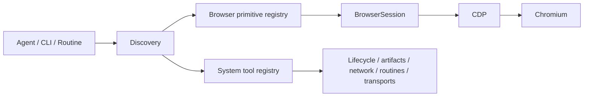
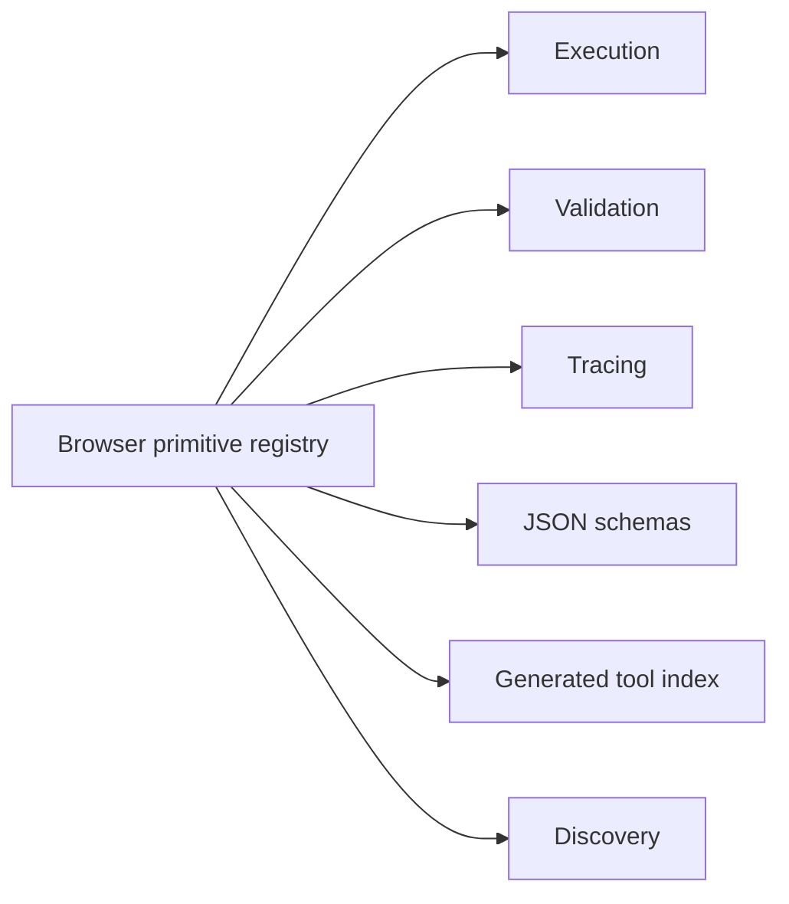

<div id="top"></div>

# Architecture

jelly separates browser transport, browser capabilities, system/integration tools, orchestration, agent-facing discovery, and an MCP adapter for remote tool clients.



The **browser primitive registry** is the source of truth for atomic capabilities that execute against a `BrowserSession`. Each primitive declares its name, description, usage, category, arguments, validation rules, and handler.



A separate **system tool registry** describes executable capabilities that should remain outside the browser primitive abstraction: browser lifecycle, screenshots and downloads, network capture, routines, and HITL. Discovery and generated documentation aggregate both registries while preserving their different execution models.

The Rust source is split by responsibility:

```text
src/
├── bin/
│   ├── agent-run.rs
│   ├── agent-discover.rs
│   ├── agent-open-browser.rs
│   └── ...
├── browser/
│   ├── session.rs
│   └── target.rs
├── artifacts.rs
├── error.rs
├── mcp.rs
├── primitives/
│   ├── input.rs
│   ├── navigation.rs
│   ├── inspect.rs
│   ├── verify.rs
│   ├── tabs.rs
│   ├── files.rs
│   └── script.rs
└── execution/
    ├── registry.rs
    ├── tools.rs
    ├── discovery.rs
    └── tracing.rs
```

Most browser primitives share one persistent `BrowserSession` inside a routine. JSON routines are guarded directed graphs: evidence is stored in context, edges can branch/loop/jump, and typed failures can select recovery paths. A graph that starts Chromium owns that browser and finalizes it on terminal completion or unhandled failure; HITL suspension preserves the session for continuation.

Executable agent entrypoints live in Cargo's native `src/bin/` layout. Standalone system tools continue to execute through the agent-tool dispatch path, which lets them manage process lifetime, files, human-intervention transport, or other concerns that do not belong in a `BrowserSession` handler. `src/mcp.rs` adapts the same registries into MCP `tools/list` and `tools/call` operations; browser primitives execute through `BrowserSession`, while system tools map structured MCP arguments back onto their existing CLI interfaces. The `.agent/` tree is reserved for declarative or generated agent-facing resources such as routines and the generated tool index.

<p align="right"><sub><a href="./README.md">⭐ Documentation index</a></sub></p>
