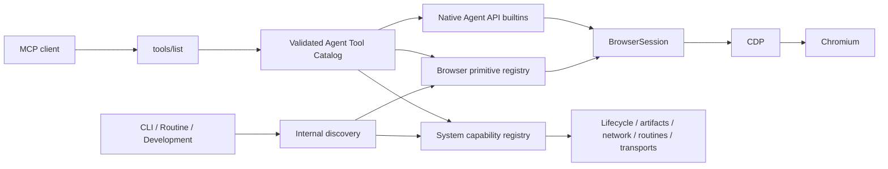
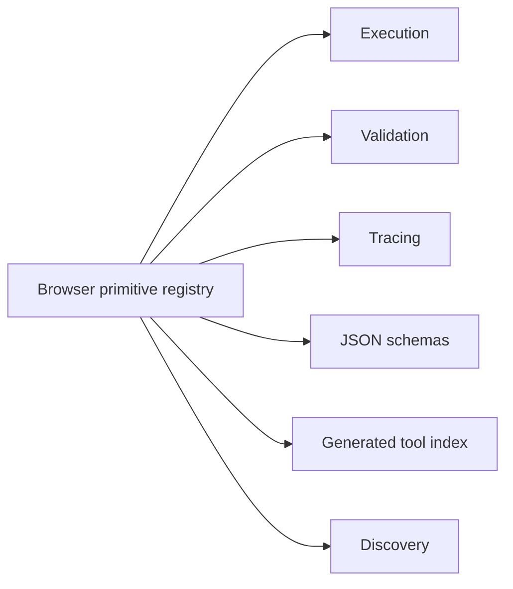

<div id="top"></div>

# Architecture

jelly separates browser transport, browser capabilities, system/integration tools, orchestration, agent-facing discovery, and an MCP adapter for remote tool clients.



The **browser primitive registry** is the source of truth for atomic capabilities that execute against a `BrowserSession`. Each primitive declares its name, description, usage, category, arguments, validation rules, and handler.



A separate **system tool registry** describes executable capabilities that should remain outside the browser primitive abstraction: browser lifecycle, screenshots and downloads, network capture, routines, and HITL. Internal discovery and the generated capability index aggregate both registries while preserving their different execution models. That internal documentation is not the MCP publication contract; the validated Agent Tool Catalog is the separate projection used by remote clients.

The Rust source is split by responsibility:

```text
src/
├── bin/
│   ├── agent-run.rs
│   ├── agent-discover.rs
│   ├── agent-open-browser.rs
│   └── ...
├── agent/
│   ├── browser_call.rs
│   ├── browser_events.rs
│   ├── browser_schema.rs
│   ├── builtin.rs
│   ├── catalog.rs
│   └── schema.rs
├── browser/
│   ├── events.rs
│   ├── perf.rs
│   ├── runtime.rs
│   ├── session.rs
│   ├── target.rs
│   └── targets.rs
├── artifacts.rs
├── error.rs
├── mcp.rs
├── mcp_auth.rs
├── primitives/
│   ├── input.rs
│   ├── navigation.rs
│   ├── inspect.rs
│   ├── verify.rs
│   ├── tabs.rs
│   ├── files.rs
│   ├── script.rs
│   └── visual.rs
└── execution/
    ├── registry.rs
    ├── named.rs
    ├── tools.rs
    ├── discovery.rs
    └── tracing.rs
```

Most browser primitives share one persistent `BrowserSession` inside a routine. MCP browser-bound catalog entries also reuse a cached `BrowserSession` by default; `JELLY_MCP_PERSISTENT_SESSION=0` restores one connection/attach per MCP call for rollback diagnostics. `BrowserSession` owns logical target state plus a bounded in-memory CDP notification ring and subscription registry. It enables Target discovery and flattened auto-attach for page targets, maintaining `sessionId ↔ targetId ↔ logical label` mappings in memory while persisting only logical labels/target IDs. Synchronous request waits retain notifications instead of discarding them, and `browser-events poll` uses a barrier request to drain pending frames before cursor/filter evaluation. Idle-event tests showed that this barrier model preserves the current poll-based contract, including explicit bounded-loss reporting under ring overflow, so Jelly intentionally does not add a background CDP reader at this stage. JSON routines are guarded directed graphs: evidence is stored in context, edges can branch/loop/jump, and typed failures can select recovery paths. A graph that starts Chromium owns that browser and finalizes it on terminal completion or unhandled failure; HITL suspension preserves the session for continuation.

Executable agent entrypoints live in Cargo's native `src/bin/` layout. Standalone system tools continue to execute through the agent-tool dispatch path, which lets them manage process lifetime, files, human-intervention transport, or other concerns that do not belong in a `BrowserSession` handler. `src/agent/` owns the validated Agent Tool Catalog and native agent-facing builtins. `JELLY_MCP_SURFACE=large-surface|small-surface` selects one validated catalog at MCP startup; absence selects `small-surface`. The selected catalog is frozen for the process lifetime, projected into `tools/list`, and used unchanged as the `tools/call` execution allowlist. `large-surface` exposes individual browser primitives plus system tools; `small-surface` is the supported default and replaces only the browser primitives with `browser-schema`, `browser-call`, and `browser-events`. Both surfaces intentionally project the exact same ordered system-tool registry and bindings. The old `legacy` and `compact` values remain temporary compatibility aliases. Lifecycle/artifact/routine aggregation, HITL exposure, and operator/admin capabilities such as profile import are separate design questions and are not coupled to the browser API cutover. Internal primitive/system registries remain canonical implementation metadata rather than the remote transport surface itself. The `.agent/` tree is reserved for declarative or generated agent-facing resources such as routines and the generated tool index.

<p align="right"><sub><a href="./README.md">⭐ Documentation index</a></sub></p>
