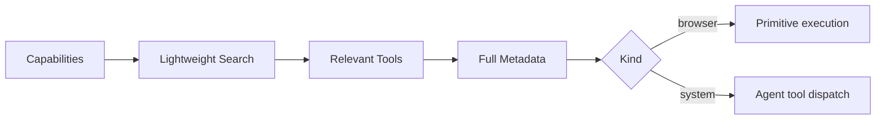

<div id="top"></div>

# Tool Discovery

jelly avoids exposing every full tool schema up front. Discovery covers two capability classes without conflating them:

- **browser primitives** — atomic operations backed by the shared Rust primitive registry and executed against a `BrowserSession`;
- **system/integration tools** — browser lifecycle, artifacts, network capture, routines, and HITL that run as standalone agent tools.



Start with capability groups:

```bash
cargo run --quiet --bin agent-discover -- capabilities
```

The result is divided into `browser` and `system` groups.

Search with normal language across both registries:

```bash
cargo run --quiet --bin agent-discover -- \
  search "request human input"
```

List one category:

```bash
cargo run --quiet --bin agent-discover -- list inspect
cargo run --quiet --bin agent-discover -- list hitl
```

Load full metadata only when needed:

```bash
cargo run --quiet --bin agent-discover -- schema click
cargo run --quiet --bin agent-discover -- schema hitl
```

Browser primitive metadata is backed by the same registry used for validation and execution. System-tool metadata is backed by a separate registry so lifecycle and integration tools remain discoverable without pretending they are `BrowserSession` primitives.

The generated reference is available at [`.agent/tools/index.md`](../.agent/tools/index.md).

<p align="right"><sub><a href="./README.md">⭐ Documentation index</a></sub></p>
