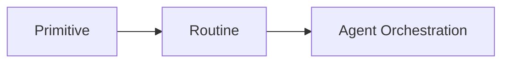

<div id="top"></div>

# Routines

Primitives are intentionally small. Routines compose them into reusable workflows while keeping one browser session alive.

Routine files live in:

```text
.agent/routines/
```

A simple routine can look like:

```text
snapshot-interactive
click @e1
wait url example.org 10
read-page
```

Run a routine with:

```bash
cargo run --quiet --bin agent-run -- call-routine <name>
```

The layers are intentionally separate:



- **Primitive**: one browser capability.
- **Routine**: a reusable workflow built from primitives.
- **Agent**: reasoning, selection, and higher-level orchestration.

Routines also support variables, signals, handoffs, and human-in-the-loop continuation state. HITL currently uses Telegram as its only transport:

```text
hitl "Approve this step, then resume"
```

The routine syntax does not name the transport; Telegram is an implementation detail of the current HITL backend.

<p align="right"><sub><a href="./README.md">⭐ Documentation index</a></sub></p>
