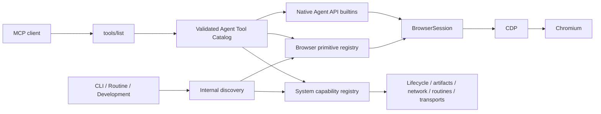
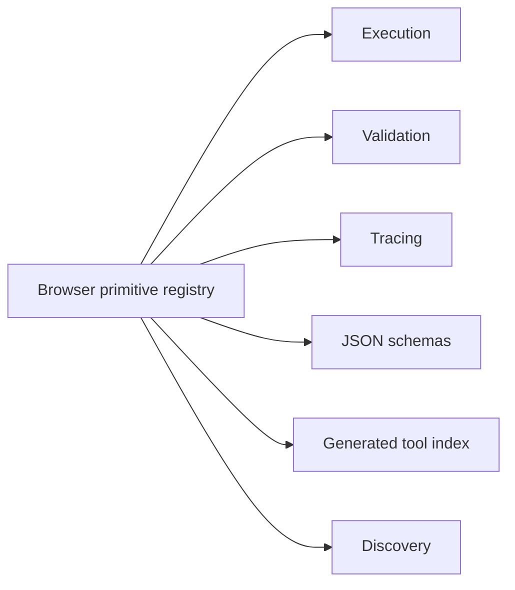

<div id="top"></div>

# Architecture

**Audience:** Developers and maintainers who need to understand system boundaries before changing Rust modules or deployment behavior.

Jelly separates browser transport, semantic browser capabilities, system/integration tools, orchestration, agent-facing discovery, MCP authentication, and a remote MCP adapter. This document explains current component relationships; see [MCP Server](../reference/MCP.md) for endpoint contracts and [Routines](../guides/ROUTINES.md) for executable workflows.



The **browser primitive registry** is the source of truth for atomic capabilities that execute against a `BrowserSession`. Each primitive declares its name, description, usage, category, arguments, validation rules, and handler.



A separate **system tool registry** describes executable capabilities that should remain outside the browser primitive abstraction: browser lifecycle, screenshots and downloads, network capture, routines, and HITL. Internal discovery and the generated capability index aggregate both registries while preserving their different execution models. That internal documentation is not the MCP publication contract; the validated Agent Tool Catalog is the separate projection used by remote clients.

The Rust source is split by responsibility:

```text
src/
├── bin/
│   ├── agent-run.rs
│   ├── agent-discover.rs
│   ├── agent-open-browser.rs
│   └── ...
├── agent/
│   ├── mod.rs
│   ├── browser_call/
│   │   ├── mod.rs
│   │   ├── prepare.rs
│   │   ├── execute.rs
│   │   ├── raw.rs
│   │   ├── result.rs
│   │   └── schema.rs
│   ├── browser_events.rs
│   ├── browser_schema.rs
│   ├── builtin.rs
│   ├── catalog.rs
│   ├── catalog_build.rs
│   ├── catalog_cache.rs
│   ├── catalog_config.rs
│   ├── schema.rs
│   └── surface.rs
├── browser/
│   ├── mod.rs
│   ├── events.rs
│   ├── perf.rs
│   ├── runtime.rs
│   ├── session.rs
│   ├── target.rs
│   ├── target_manager.rs
│   └── transport.rs
├── core/
│   ├── mod.rs
│   ├── downloads.rs
│   ├── oauth.rs
│   ├── ranking.js           # pure browser-side ranking (injected by Rust)
│   ├── routines.rs
│   ├── session.rs
│   └── targets.rs
├── shell/
│   ├── mod.rs
│   ├── downloads.rs
│   ├── routines.rs
│   ├── session.rs
│   └── targets.rs
├── mcp/
│   ├── mod.rs
│   ├── dispatch.rs
│   ├── protocol.rs
│   └── system_tools.rs
├── mcp_auth/
│   ├── mod.rs
│   ├── dcr.rs
│   ├── oauth.rs
│   ├── local_approval.rs
│   ├── pages.rs
│   ├── state.rs
│   └── storage.rs
├── primitives/
│   ├── mod.rs
│   ├── input.rs
│   ├── navigation.rs
│   ├── inspect.rs
│   ├── js_helpers.rs
│   ├── verify.rs
│   ├── tabs.rs
│   ├── files.rs
│   ├── script.rs
│   ├── storage.rs
│   └── visual.rs
├── execution/
│   ├── mod.rs
│   ├── registry.rs
│   ├── named.rs
│   ├── tools.rs
│   ├── discovery.rs
│   └── tracing.rs
├── artifacts.rs
├── browser_launcher.rs
├── connection.rs
├── error.rs
├── recording.rs
├── routine.rs                 # public compatibility entrypoint
└── lib.rs
```

## Functional core and imperative shell

The dependency direction is **shell → core**. Core functions receive observed values
as arguments and make decisions without opening browsers, reading files, or
accessing global runtime configuration.

| Area | Core decision (`src/core/`) | Effectful adapter (`src/shell/`) |
| --- | --- | --- |
| Browser sessions and targets | Cache and logical-target policy | `session.rs` maintains CDP sessions; `targets.rs` reconciles targets and persists labels. |
| Downloads and artifacts | Lifecycle transitions, collision plans, finalization decisions | `downloads.rs` observes browser events, manages files, and registers artifacts. |
| Routines | Graph validation, guards, node and tool-outcome planning | `routines.rs` runs subprocesses, manages browser calls, human approval, clocks and persistence. |
| OAuth | Authorization-code, PKCE and refresh/replay policy | `mcp_auth/oauth.rs` and `storage.rs` manage tokens, locks and durable grants. |
| Page-side ranking | `core/ranking.js` compares normalized candidates | `browser/runtime.rs` observes the DOM and injects the ranking code. |

Some public APIs remain exported from their established modules:
`jelly::routine::run_from_env` through `src/routine.rs`, `LogicalTarget` and
`TargetRegistry` through `browser/mod.rs`, and `jelly::DownloadRecord` through
the library root. The MCP dispatcher uses the session adapter and translates
errors into MCP tool failures. Download file operations can use explicit temporary
directories; artifact finalization requires the persistent store.

OAuth handlers remain in `mcp_auth/`: the adapter reads the clock, generates
tokens, locks and persists the store, and applies the grant/PKCE rules from
`core/oauth.rs`. Tests cover policy decisions, HTTP token exchange and durable
store reload. Persistence fault injection is not covered.

**In-page semantic ranking** compares candidate match quality, disabled state,
viewport visibility, and document order in `src/core/ranking.js`. Both
`search`/`resolveText` and the rollback `legacy_search_expression` use this
ranking logic. DOM and open-Shadow-DOM traversal, accessibility names,
mutation invalidation, and element references remain in `src/browser/runtime.rs`.

The page runtime is version **20** and reinstalls itself when an older version
is detected. Comparison fixtures for version 19 live in
`tests/fixtures/page-runtime-v19.js`. Run `./scripts/dev.sh test --ranking`
to check behavior in disposable Chromium profiles. These tests do not establish
production latency equivalence.

The functional core/shell separation is not exhaustive. `browser/`, `primitives/`, `mcp/`, `mcp_auth/`, and parts of `shell/routines.rs` and `shell/targets.rs` contain decisions alongside effects. Routine text interpolation and graph validation retain their existing semantics.

The isolated integration harness lives in `src/bin/jelly-fcis-probe.rs` and runs via
`./scripts/dev.sh test --isolated`. It compiles a sanitized working-tree copy
with its own runtime and binaries, drives Chromium CDP and MCP HTTP using
loopback-only processes, and checks OAuth persistence, routine state,
download artifact finalization, and browser-session recovery. The real CDP
download tracker, persistence fault injection, and external HITL delivery
still require dedicated isolated tests; passing the harness does not
establish complete behavioral equivalence under those failure modes.

## Connection and authentication boundaries

Jelly supports two **client onboarding profiles** in `src/connection.rs`: `ChatGPT` and `GenericMcp`. A profile combines a provider name, client connection method (`local-http` or `remote-http`), and desired authentication method (`bearer-token` or `oauth`). `stdio` and unauthenticated (`none`) modes are reserved but not implemented. Connection profiles do not configure per-client authorization policies or create additional MCP listeners.

`src/bin/jelly-mcp.rs` validates explicit profiles before opening the server. The plain HTTP listener must bind to loopback; a remote profile additionally requires a public HTTPS URL, typically supplied by a hosting wrapper. The server accepts its configured static bearer token and OAuth access tokens regardless of which onboarding profile the client used.

`src/mcp_auth/` owns the OAuth and operator-approval boundary:

- `dcr.rs`, `oauth.rs`, `state.rs`, and `storage.rs` handle client registration, OAuth exchange, state, and persistence.
- `pages.rs` renders the shared Jelly shell.
- `local_approval.rs` provides loopback-only ChatGPT connection and approval pages when both paired consent and public ChatGPT DCR are enabled.

Public `/health` and `/ready` report minimal MCP service state, not browser availability. Detailed `/dashboard`, `/status`, and `/status.json` require operator access through an owner session or administrative bearer credential; ordinary OAuth access tokens are insufficient. This is a **single-owner, process-wide browser session**, not an isolated per-client browser service. The risk boundary for direct privileged CDP is documented in [MCP Server](../reference/MCP.md#raw-cdp-trust-boundary).

Most browser primitives share one persistent `BrowserSession` inside a routine. MCP browser-bound catalog entries also reuse a cached `BrowserSession` by default; `[mcp].persistent_session = false` restores one connection/attach per MCP call for rollback diagnostics. `BrowserSession` owns logical target state plus a bounded in-memory CDP notification ring and subscription registry. It enables Target discovery and flattened auto-attach for page targets, maintaining `sessionId ↔ targetId ↔ logical label` mappings in memory while persisting only logical labels/target IDs. Synchronous request waits retain notifications instead of discarding them, and `browser-events poll` uses a barrier request to drain pending frames before cursor/filter evaluation. Idle-event tests showed that this barrier model preserves the current poll-based contract, including explicit bounded-loss reporting under ring overflow, so Jelly intentionally does not add a background reader to `BrowserSession` itself.

Download lifecycle is the deliberate exception at the browser-service layer. `browser_launcher` opens a separate browser-level CDP connection, enables `Browser.downloadWillBegin`/`Browser.downloadProgress` through `Browser.setDownloadBehavior`, and persists bounded download records under a file lock so system-tool processes can list, wait, cancel, and finalize downloads independently of any one `BrowserSession`. This tracker does not feed the browser-events ring. JSON routines are guarded directed graphs: evidence is stored in context, edges can branch/loop/jump, and typed failures can select recovery paths. A graph that starts Chromium owns that browser and finalizes it on terminal completion or unhandled failure; HITL suspension preserves the session for continuation.

Executable agent entrypoints live in Cargo's native `src/bin/` layout. Standalone system tools continue to execute through the agent-tool dispatch path, which lets them manage process lifetime, files, human-intervention transport, or other concerns that do not belong in a `BrowserSession` handler. `src/agent/` owns the validated Agent Tool Catalog and native agent-facing builtins. `config/jelly.toml` `[mcp].surface` selects one validated catalog at MCP startup. The selected catalog is frozen for the process lifetime, projected into `tools/list`, and used unchanged as the `tools/call` execution allowlist. `large-surface` exposes individual browser primitives plus system tools; `small-surface` is the supported default and replaces only the browser primitives with `browser-schema`, `browser-call`, and `browser-events`. Both surfaces intentionally project the exact same ordered system-tool registry and bindings. Lifecycle/artifact/routine aggregation, HITL exposure, and operator/admin capabilities such as profile import are separate design questions and are not coupled to the browser API cutover. Internal primitive/system registries remain canonical implementation metadata rather than the remote transport surface itself. The `.agent/` tree is reserved for declarative or generated agent-facing resources such as routines and the generated tool index.

<div align="right"><sub><a href="#top">&uarr; Back to top</a> · <a href="../INDEX.md">Documentation index</a></sub></div>
