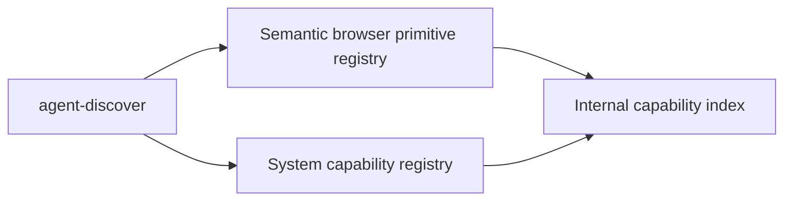
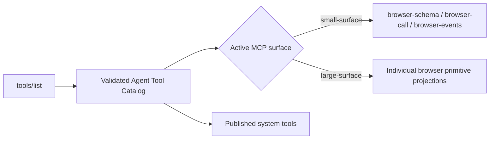

<div id="top"></div>

# Capability and Agent API Discovery

Jelly has two separate discovery planes. They answer different questions and must not be conflated.

## Internal capability discovery

The internal capability layer describes Jelly's canonical implementation registries:

- **semantic browser primitives** — atomic operations backed by the Rust primitive registry and executed against a `BrowserSession`;
- **system/integration capabilities** — lifecycle, artifacts, network capture, routines, and HITL described by the system-tool registry.

This layer is used by the CLI, routines, development tooling, generated internal documentation, and tests. It is not automatically the remote MCP tool surface.



Use the CLI discovery commands when working with the internal capability model:

```bash
cargo run --quiet --bin agent-discover -- capabilities
cargo run --quiet --bin agent-discover -- search "request human input"
cargo run --quiet --bin agent-discover -- list inspect
cargo run --quiet --bin agent-discover -- schema click
cargo run --quiet --bin agent-discover -- schema hitl
```

Browser primitive metadata comes from the same registry used for validation and execution. System capability metadata comes from its separate registry.

The generated internal reference is [`.agent/tools/index.md`](../../.agent/tools/index.md). Its entries are implementation capabilities, not a promise that each name is remotely published through MCP.

## Published Agent API discovery

Remote MCP clients must treat `tools/list` as the authoritative published Agent API.



The selected Agent Tool Catalog controls both publication and execution. A capability omitted from that catalog is neither advertised nor executable by guessing its internal name.

In **small-surface** mode, browser capabilities are not discovered by enumerating the internal primitive index. Use the published `browser-schema` tool:

- `capabilities` — summarize semantic browser capability groups;
- `search` — find a semantic browser operation by intent;
- `schema` — load the named JSON argument contract for one semantic operation.

Then execute the discovered semantic operation through `browser-call`.

In **large-surface** mode, individual browser primitives are published directly. Their schemas come from `tools/list`.

System tools remain top-level in both rollout surfaces during the current browser API migration.

## Layer boundary

```text
primitive_specs / tool_specs
  internal implementation registries

agent-discover
  internal CLI/development discovery

.agent/tools/index.md
  generated internal capability reference

AgentToolCatalog
  validated publication/execution projection

tools/list
  authoritative remote MCP surface

browser-schema
  small-surface remote discovery of semantic browser operations
```

Do not use the generated internal capability index as a substitute for `tools/list`, and do not assume an internal primitive name is remotely callable.

<p align="right"><sub><a href="./README.md">⭐ Documentation index</a></sub></p>
